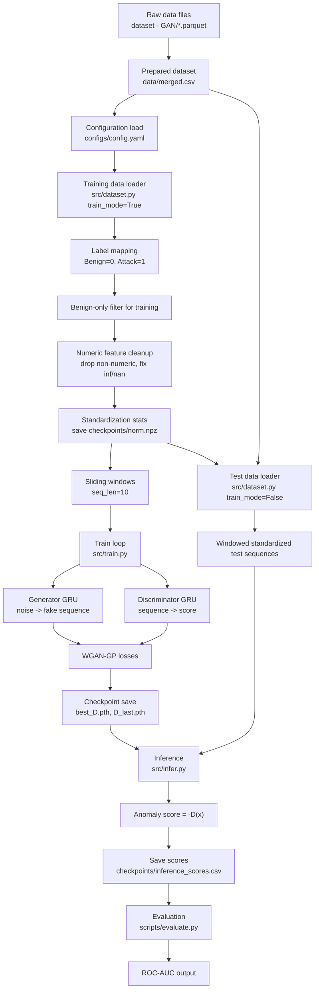

# FIN-GAN Project Flow

This project is a GAN-based anomaly detection pipeline for network flow data.  
It trains on benign traffic sequences and uses the trained discriminator score to detect anomalous traffic.

## End-to-End Flow (Mermaid)

## Complete Project Flow

### 1. Data Inputs and Config

- Main runtime dataset: `data/merged.csv`
- Optional raw source files: `dataset - GAN/*.parquet`
- Runtime settings live in `configs/config.yaml`:
  - `train_csv`, `test_csv`
  - `label_column` (currently `Label`)
  - `seq_len`, `batch_size`, `epochs`, `lr`, `device`

### 2. Dataset Processing (`src/dataset.py`)

`FlowDataset` is the common data pipeline used by both training and inference.

1. Reads CSV into a DataFrame.
2. Converts labels to binary if labels are strings:
   - `Benign -> 0`
   - anything else -> `1`
3. If `train_mode=True`, keeps only benign rows (`label == 0`).
4. Removes label column from features.
5. Keeps only numeric columns.
6. Replaces `inf/-inf` with `NaN`, then fills `NaN` with `0.0`.
7. Builds `float32` feature matrix.
8. Normalizes features:
   - training mode: computes `mean/std` and saves `checkpoints/norm.npz`
   - inference mode: loads `checkpoints/norm.npz` and reuses same stats
9. Builds sequence windows of length `seq_len` using sliding windows.
10. For each window, label is taken from the last row in that window.

`get_loader(...)` wraps this into a PyTorch `DataLoader`.

### 3. Model Definitions (`src/model.py`)

- `Generator`:
  - GRU over random noise sequence
  - linear projection per timestep to feature space
  - outputs fake feature sequences with same shape as real windows
- `Discriminator` (critic in WGAN):
  - GRU over input feature sequence
  - takes last hidden state
  - linear head to single scalar score
  - no sigmoid (correct for Wasserstein objective)

### 4. Training (`src/train.py`)

Training uses a WGAN-GP style objective.

1. Loads config and training loader (`train_mode=True`, benign-only windows).
2. Initializes:
   - `G = Generator(noise_dim=32, hidden=64, out_dim=feature_dim)`
   - `D = Discriminator(in_dim=feature_dim, hidden=64)`
3. Creates Adam optimizers for both models.
4. For each batch:
   - samples random noise `z`
   - generates fake sequence `fake_x = G(z)`
   - scores real and fake with `D`
   - computes gradient penalty on interpolated samples
   - critic loss:
     - `d_loss = -(mean(D(real)) - mean(D(fake))) + 10*GP`
   - updates `D`
   - generator loss:
     - `g_loss = -mean(D(fake))`
   - updates `G`
5. Tracks average critic loss per epoch.
6. Saves best discriminator as `checkpoints/best_D.pth`.
7. Saves final discriminator as `checkpoints/D_last.pth`.

### 5. Inference (`src/infer.py`)

1. Loads config and test loader (`train_mode=False`).
2. Loads discriminator checkpoint (`checkpoints/D.pth` in current script).
3. Runs `D` on each test window.
4. Converts model output to anomaly score with:
   - `score = -D(x)`
5. Saves scores and labels to:
   - `checkpoints/inference_scores.csv`

### 6. Evaluation (`scripts/evaluate.py`)

1. Reads `checkpoints/inference_scores.csv`.
2. Computes ROC-AUC using:
   - true labels (`Label`)
   - predicted anomaly scores (`score`)
3. Prints final ROC-AUC value.

## Practical Notes

- Current training script saves `best_D.pth` and `D_last.pth`.
- Current inference script loads `D.pth`.
- To evaluate the latest trained model, inference should load the same checkpoint name that training produces.
